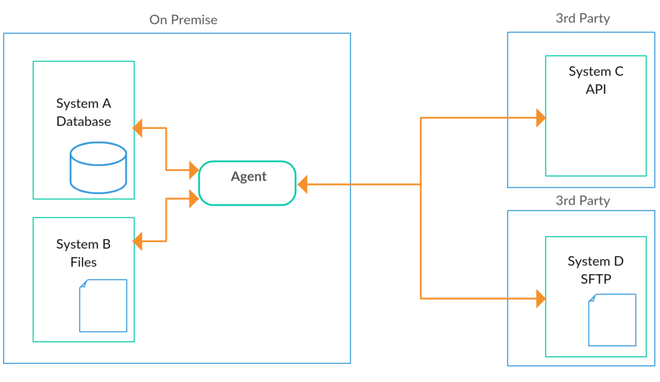

# PipeScript&reg;

This is a Draft Specification for PipeScript&reg;, a [DSL](https://en.wikipedia.org/wiki/Domain-specific_language) (domain specific language) for describing how to orchestrate the flow of data between systems. PipeScript&reg; is brought to you by the people at Actio Pty Ltd. We believe in an open and accessible evolution of this DSL and welcome your feedback. [DataPipes](https://github.com/ActioPtyLtd/datapipes-examples) is the official interpreter of PipeScript&reg; written in Scala and runs on the JVM, allowing for it to be deployed on Windows, Linux and macOS systems. 

## Introduction

This project was conceived by the authors out of the need to simplify, unify and standardise the approach of coordinating the flow of data between systems while being agnostic to technology. To be able to concisely describe this protocol in a human readable format was pivotal. Additional factors included the dissatisfaction with commonly used ETL tools such as SSIS and Pentaho due to concerns of fragility, maintainability and lack of flexibility to name just a few.

A very typical need that businesses have in today's modern data architecture is for their systems to interchange data with another as well as other 3rd party interfaces and cloud services:



One of the objectives of the implementor of PipeScript&reg; is for the application to be lightweight, cross-platform and easy to deploy. Robustness, security, monitoring and logging should be centre to core platform features.

## Key Concepts

### The DOM
DOMs are the data structures produced and consumed by [Tasks](#tasks). Pipelines enable and coordinate the flow of DOMs between Tasks. Tasks have the capability to investigate and utilise components of the DOM through [expressions](#expressions). To picture the DOM hierarchy in-flight, let's use the following as an example:

-D0>(T1)-D1>(T2)-D2(end))

We have two Tasks *T1* and *T2*. Task *T1* will firstly consume the initalisation DOM *D0*. *T1* then produces the DOM *D1*, which *T2* will consume before *T2* produces the DOM *D2* to complete the pipeline. For illustration purposes, this example only shows a Task consuming and producing a single DOM each, whereas in reality Tasks may produce many DOMs, such as Tasks that extract data out of DataSources.

In more detail, the DOM captures [DataSets](#datasets) which have been sucessfully (or unsuccessfully) extracted or utilised by a Task together with any events captured in the process. They can be visualised as follows:

<!--[note: DOMs are immutable objects that flow through Pipes and Tasks {bg:cornsilk}]

[DOM]++-successful/failed>[DataSet]
[DOM]++-events *>[Events]
[DOM]++-child *>[DOM]-->


### Tasks
The function of a Task is to consume DOMs and produce further DOMs. They may or may not perform side-effects before producing further DOMs. You can say Tasks *react* on external events captured by DOMs.

->(Task)->(end))

Tasks at a high level can be of either extract, transform or load type:

* Extractors - query DataSources to create a stream of data
* Transformers - transform the incoming stream of data
* Loaders - push the incoming stream of data to DataSources

Tasks also have a lifecycle of the following:

* initialisation
* consumption and production of DOMs
* completion

Therefore it is not unreasonable to assume Tasks capture private state. This makes [Actors](https://en.wikipedia.org/wiki/Actor_model) a great fit to model them in a concurrent setting.

### Pipelines
Given that Tasks are consumers and producers of DOMs, Pipelines dictate how to coordinate the flow of DOMs between Tasks. Pipelines can be synchronous or asynchronous in nature. 

They can for example connect extractors and transforms together and similarly transforms to loaders to create a simple ETL pipeline.

->(Extract)->(Transform)->(Load)->(end))

### DataSets
DataSets are hierarchical data structures used in DOMs. Elements of the data structure can be accessed using [expressions](#expressions) within Tasks. DataSets can be defined by the following data types: 

<!--
[note: DataSets contain typed hierarchical data{bg:cornsilk}]

[<<DataSet>>]^[String]
[<<DataSet>>]^[Date]
[<<DataSet>>]^[Numeric]
[<<DataSet>>]^[Boolean]
[<<DataSet>>]^[Record]
[<<DataSet>>]^[Empty]
[<<DataSet>>]^[Array]
[Record]<>-fields*[<<DataSet>>]
[Array]<>-items*[<<DataSet>>]
-->


These data structures can be thought of as json structures, such as the following:

```json
{
  "person": {
    "firstName": "John",
    "lastName": "Smith",
    "address": {
      "addr1": "George St.",
      "addr2": "Sydney",
      "postcode": 2000
    },
    "phoneNumbers": [
      "98765432",
      "87654321",
      "76543212"
    ]
  }
}
```

### Events
Tasks may generate Events, such as when the task started and completed, or if any exceptions occurred during processing. They essentially capture activity throughout the life cycle of a Task. This also includes capturing metrics. Events can be visualised as follows:


## PipeScript&reg; Sections

PipeScript is captured in the [HOCON](https://github.com/lightbend/config) format and is composed of the following sections:

1. [Tasks](#tasks-section) - defines operations to be performed using the incoming DOM
2. [DataSources](#datasources-section) - defines how to connect and communicate with a source
2. [Pipelines](#pipeline-section) - defines flow control of DOMs between Tasks
3. [Services](#services-section) - allows for pipeline operations to be exposed as RESTful endpoints
4. [Startup](#startup-section) - defines which pipeline to execute by default

The following BNF form of PipeScript&reg; is captured below:

```BNF
<script> ::= 
  'script {' 
    <sections> 
  '}'

<sections> ::= 
  <settings>
  <task_section>
  [<pipelines_section>]
  [<services_section>]
  [<schedule_section>]
  <startup>
```

Example layout:

```
script {
  settings {
    ...
  }
  tasks {
    ...
  }
  pipelines {
    ...
  }
  services {
    ...
  }
  schedule {
    ...
  }
  startup {
    ...
  }
}
```

## Pipeline Section
```BNF
<pipelines_section> ::= 
  'pipelines { ' 
    <pipelines>
  '}'

<pipelines> ::= 
  <pipeline>
  [<pipelines>]

<pipeline> ::= 
  <name> ' {'
    [<schedule>]
    'pipe = "' <pipeline_expression> '"
  }'

<schedule> ::= 
  'schedule {
    cron = "' <cron_expression> '"
  '}'

<pipeline_expression> ::= <name> ['(' <args> ')'] [<pipeline_operator> <pipeline_expression>]
<pipeline_operator> ::= ('|' | '&')
```

Example:

```
  pipelines {
    load_users_to_datalake {
      pipe = "extract_users_from_DB | filter_only_active_users | load_user_to_datalake"
    }
  }
```
This example pipeline will extract users from a database and load it into the datalake.

### Pipeline Schedule
By specifying a schedule component for a pipeline, the interpreter should ensure the pipeline is executed at appropriate times defined by a [cron expression](https://en.wikipedia.org/wiki/Cron).

The cron expression is comprised of 6 fields separated by white space. The fields are:

| Field name   | Allowed Values  | Allowed Special Chars |
| ------------ | --------------- | --------------------- |
| Seconds      | 0-59            | ,-*/                  |
| Minutes      | 0-59            | ,-*/                  |
| Hours        | 0-23            | ,-*/                  |
| Day of month | 1-31            | ,-*?/                 |
| Month        | 1-12 or JAN-DEC | ,-*/                  |
| Day of week  | 1-7 or SUN-SAT  | ,-*?/                 |

Special Chars:

* \* (“all values”) - used to select all values within a field. For example, “*” in the minute field means “every minute”.

* ? (“no specific value”) - useful when you need to specify something in one of the two fields in which the character is allowed, but not the other. For example, if I want my trigger to fire on a particular day of the month (say, the 10th), but don’t care what day of the week that happens to be, I would put “10” in the day-of-month field, and “?” in the day-of-week field. See the examples below for clarification.

* \- used to specify ranges. For example, “10-12” in the hour field means “the hours 10, 11 and 12”.

* , used to specify additional values. For example, “MON,WED,FRI” in the day-of-week field means “the days Monday, Wednesday, and Friday”.

* / used to specify increments. For example, “0/15” in the seconds field means “the seconds 0, 15, 30, and 45”. And “5/15” in the seconds field means “the seconds 5, 20, 35, and 50”. You can also specify ‘/’ after the ‘’ character - in this case ‘’ is equivalent to having ‘0’ before the ‘/’. ‘1/3’ in the day-of-month field means “fire every 3 days starting on the first day of the month”.


Example:

```
    load_users_to_datalake {
      schedule {
        cron = "0 0 1 * * ?"
      }
      pipe = "extract_users_from_DB | filter_only_active_users | load_user_to_datalake"
    }
```
This example pipeline will extract users from a database and load it into the datalake at 1 a.m. every day.

### The Pipe Operator (|)
To demonstrate the Pipe operator, take the following two [Tasks](#task-section) *T1* and *T2* as an example:
```
T1 | T2
```
1->(T1)2->(T2))

For every [DOM](#the-dom) *T1* receives (1), it will execute its task on the DOM and potentially produce further DOMs which *T2* will consume in similar fashion (2).

### The Ampersand Operator (&)
To demonstrate the Ampersand operator, take the following two tasks *T1* and *T2* as an example:
```
T1 & T2
```

1->(T1)2->(start)3->(T2))

For every DOM *T1* consumes (1), allow for *T1* to produce **all** its DOM's and complete (2) its operation entirely before allowing *T2* to consume the same DOM (3).

## Tasks Section
Tasks can be identified by name and live under the tasks section of the configuration. Each task should have a task type defined which indicates what function it has. Generally, if a task supports different behaviors it will have a behavior defined. For Extractors and Loaders, tasks will require a Data Source to be defined.

The following BNF describes the supported syntax for tasks:
```BNF
<task_section> ::= 'tasks { ' <tasks> ' }'
<tasks> ::= <task> [<tasks>]
<task> ::= <name> ' { type = "' <text> '"' [<key_values>] [<datasource_section>] '}'
```

The following Task types supported are explained below:
* Extract - extract data from a DataSource
* Transform - transform data using an expression
* Assert - validate the data
* Load - create data in a DataSource
* Merge - create or update a DataSource using a key


### Task Extract
To extract data from a data source (using a task called *task_extract*), you will need the following definition:
```HOCON
task_extract {
  type = extract
  dataSource {
    ...
    query {
      read {
        ...
      }
    }
  }
}
```

The following properties are explained below:
* **type** - Always set to extract.
* **dataSource** - Contains the section that defines which [DataSource](#datasource-section) to connect to and extract data.

The Task will execute the *read* query against the defined DataSource for each item in the incoming DOMs (successful) DataSet. Each of the items (also DataSets) will be in scope in any [expressions](#expressions) used in the query part. The task produces DOMs extracted from the DataSource.

Example:

```HOCON
task_extract {
  type = extract
  dataSource {
    type = jdbc
    connect = "jdbc:postgresql://localhost/finance?user=fred&password=secret&ssl=true"
    query {
      read {
        sql = "select * from invoices where amount >= $min_amount"
      }
    }
  }
}
```
This example Task produces data by connecting to a postgresql database and querying the SQL table *invoices*, filtering by the supplied *min_amount* variable.

### Task Transform
To transform data using an expression (using a task called *task_transform*), you will need the following definition:
```
task_transform {
  type = transformTerm
  [behavior = ('batch' | 'expand')]
  term = '"' <expression> '"'
}
```

The following properties are explained below:
* **type** - Always set to transformTerm.
* **behavior** - when using *batch*, the transform is performed at a batch level, when using *expand*. The default is to transform at the DOM DataSet item level.
* **term** - the [expression](#expressions) to evaluate so the task will produce a new DOM with the DataSet result.

### Task Assert
To assert that the incoming DOM meets your criteria using an expression (using a task called *task_assert*), you will need the following definition:
```
task_assert {
  type = assert
  term = '"' <expression> '"'
  [abort = ('true' | 'false')]
  [statuscode = <number>]
  message = '"' <text> '"'
}
```

The following properties are explained below:
* **type** - Always set to assert.
* **term** - the [expression](#expressions) to evaluate to determine if the DataSet meets the correct criteria. This should return a Boolean.
* **abort** - the property specifies whether the application should abort if the assertion isn't met. Default value is false.
* **statuscode** - the property allows one to specifiy a code that may be used as an application exit code if the assertion isn't met. The default is 1.
* **message** - a descriptive text for the reason of failure.

Example:
```
task_assert {
  type = assert
  term = "this.amount.isDefined() && this.amount >= 50.00"
  abort = true
  message = "Premium amount shouldn't be null or less than $50."
}
```
This task will test for whether an amount is specified and greater than equal 50. If data can be found that fails to meet this criteria, abort immediately and return an exit code of 1.

### Task Load
To load data into a data source (using a task called *task_load*), you will need the following definition:
```
task_load {
  type = load
  dataSource {
    ...
    query {
      create {
        ...
      }
    }
  }
}
```

The following properties are explained below:
* **type** - Always set to load.
* **dataSource** - Contains the section that defines which [DataSource](#datasource-section) to connect to and load data.


### Task Merge
To merge and load data  into an entity using a set of keys (using a task called *task_merge*), you will need the following definition:
```
task_merge {
  type = mergeLoad
  entity = <entity_name>
  keys = '[' <properties> ']'
  [update = ('true' | 'false')]

  dataSource {
    ...
  }
}
```

The following properties are explained below:
* **type** - Always set to mergeLoad.
* **entity** - The name of the entity where data will be merged to.
* **keys** - a list of properties, comma seperated, that will identify whether the item in entity should be created or updated.
* **update** - Specifies whether the matched items shoud be updated if differences are detected. Default is true.
* **dataSource** - Contains the section that defines which [DataSource](#datasource-section) to connect to and merge data.

## DataSources Section
DataSources define systems where data can be retrieved and manipulated. Queries are ways of interacting with that system and its use depends on the communication protocol of that DataSource. Queries that extract data out of a system will produce DataSets, while manipulation of the DataSource data will require the DataSource to consume DataSets. All queries allow for templating so that incoming data can potentially be used to produce different queries.

The DataSource section can be described in BNF form as follows:
```BNF
<datasource_section> ::= 'dataSource { ' <datasource> ' }'
<datasource> ::= 'type = "' <text> '"' [<key_values>] [query_section]

<query_section> ::= 'query {' <datasource_queries> '}'
<datasource_queries> ::= <datasource_query> [<datasource_queries>]
<datasource_query> ::= <name> ' {' <templates> '}'

<templates> ::= <name> ' = "' <template> '"' [<templates>] 
<template> ::= <text> [('$' <expression> | '${' <expression> '}')] <template>

```

The following sections describe how to configure DataSources for Databases, Files, S3 and Http

### Databases
To execute sql queries against a database, include the JDBC connection string that will access the relevant database. The DataSource section in BNF form is as follows:

```
datasource ::= '
  dataSource {
    type = sql
    connection {
      url = ' <url> '
    }
    query {
      ' <verb> '{
        sql = ' <sql> '
      }
    }
  }'
```

The following properties are explained below:
* **url** - The JDBC connection string.
* **sql** -  The SQL script to execute.

Example:

```
dataSource {
  type = sql
  connection {
    url = "jdbc:postgresql://localhost/finance?user=fred&password=secret&ssl=true"
  }
  query {
    read {
      sql = "select * from invoices where amount >= $min_amount"
    }
  }
}
```

### Files

```
datasource ::= '
  dataSource {
    type = file
    [<format>]
    [<protocol>]
    query {
      ' <verb> ' {
        directory = ' <directory> '
        fileName = ' <fileName> '
      }
    }
  }'

format ::= 'format = ' <file_format>
file_format ::= 'txt' | 'csv' | 'dbf' | 'xls' | 'json'

protocol ::= 'protocol = ' <file_protocol>
file_protocol ::= 'lfs' | 'ftp' | 'sftp' | 's3'

```

The following properties are explained below:
* **format** - *optional*. Specifies what type of file is being used. The default value is txt.
* **protocol** - *optional*. Specifies what transfer protocol should be used. The default is local file system (lfs).
* **directory**  - The directory of where the file(s) reside.
* **fileName**  - A regular expression of the file(s) to read or write to.

Example:

```
dataSource {
    type = file
    format = csv
    query {
      read {
        directory = "./employees"
        fileName = "employees.csv"
      }
    }
  }

```

### Http(s)
To perform http requests against an endpoint, the following BNF definition can be used:

```
datasource ::= '
  dataSource {
    type = http
    [<connection>]
    [<headers>]
    query {
      ' <verb> ' {
        ' [<query_method>] '
        uri = ' <uri> '
        ' <query_body> '
      }
    }
  }
'

connection ::= ' 
  connection {
    credentials {
      username = ' <username> '
      password = ' <password> '
    }
  }'

headers ::= '
  headers {
    ' <header_list> '
  }'

header_list ::= 
  <header>
  <header_list>

header ::= <key> ' = "' <value> '"'

query_body ::= ' body = "' <body> '"'
query_method ::= ' method = "' <method> '"'

```

The following properties are explained below:
* **connection** - *optional*. This section is optional. Use when Basic Authentication is required.
* **username**  - The user to authenticate as.
* **password** - The password to authenticate with.
* **headers** - *optional*. This is not required if no headers need to be used.
* **key** - The name of the header to include in all queries.
* **value** - The value of the header to include in all queries.
* **method** - The http method. Default is *get*.
* **body** -  The http body, which may be text, XML or JSON. The default is no body

Example:

```
dataSource {
  type = http
  connection {
    credentials {
      username = "fred"
      password = "secret"
    }
  }
  headers {
    Content-Type = "application/json"
  }
  query {
    create {
      method = put
      uri = "https://somdomain.com.au/api/v1/user/$userid"
      body = "${user_body.toJson()}"
    }
    ...
  }
}
```

## Services Section
The Services Section allows one to define API endpoints and the appropriate routing that needs to occur for different http methods. The BNF form is shown below:

```BNF
<services_section> ::= 'service {' [<port>] <routes> '}'
<port> ::= 'port = ' <number>
<routes> ::= ' routes = [ ' <routeList> ' ]'
<routeList> ::= <route> [',' <routeList>]
<route> ::= '{ path =  "' <url> '"' <route_methods> ' }'
<route_methods> ::= <route_method> [<route_methods>]
<route_method> ::= ('get' | 'put' | 'post' | 'patch' | 'delete') ' = ' <name>
```
Note: *name* here is the name of the pipeline to start if the spefific method is called.

Example:

```HOCON
service {
  port = 8080
  routes = [
    {
      path = "/api/v1/users"
      get = get_users
    },
    {
      path = "/api/v1/user/$userid"
      get = get_user
      put = update_user
    }
  ]
}
```

This configuration will provide access to two endpoints on port 8080, one to extract users by calling the get_users pipeline and another that allows for a specific user to be retrieved or updated. Note the *userid* parameter will be extracted and passed onto either pipeline. For the update_user pipeline, the http request as well as the *userid* parameter will be provided.

To test the users endpoint, you can use curl as follows:
```
$ curl http://localhost:8080/api/v1/users
```

## Startup Section
The Startup Section allows one to specify the default pipeline to execute if no specific pipeline is specified on the command line. The BNF is as follows:

```BNF
<startup> ::= 'startup { exec = ' <name> ' }'
```

Note: Here *name* is the default pipeline to execute.

## Common
```BNF

<key_values> ::= <name>
<name> ::= ;alphanumeric text
<value> := ;text or number
<args> ::= <name>

<url> ::= ;text with optional variables

```

## Expressions
```BNF
<expression> ::= 
  <literal> | 
  <variable> | 
  <select> | 
  <apply> | 
  <user_function> | 
  <operator_expression> | 
  <if_statement>

<literal> ::= <number> | ('"' <text> '"') | 'false' | 'true'
<variable> ::= <name>
<apply> ::= <name> '()'
<user_function> ::= <name> '(' <args> ')'
<args> ::= <expression> [',' <expression>]
<select> ::= <expression> '.' (<variable> | <apply>)
<operator_expression> ::= <expression> <operator> <expression>
<operator> ::= '+' | '-' | '*' | '/' | '&&' | '||' | '<' | '>' | '<=' | '>=' | '->' | '==' | '!' | '!='
<if_statement> ::= 'if(' <expression> ')' ['elseif(' <expression> ')'] 'else' <expression>
```

All expressions evaluate to a [DataSet](#dataset). We will use the following example DataSet (call it *ds*) to demonstrate the different type of expressions.

```json
{
  "person": {
    "firstName": "John",
    "lastName": "Smith",
    "address": {
      "addr1": "George St.",
      "addr2": "Sydney",
      "postcode": 2000
    },
    "phoneNumbers": [
      "98765432",
      "87654321",
      "76543212"
    ]
  }
}
```

### Literal
Literals can be of type Numeric, String, Boolean:

```javascript
> 2000
2000: Numeric
> "text"
"text": String
> false
false: Boolean
```

### Selection
Given a DataSet, dot notation allows one to access elements contained within the structureby name. 

To access the persons first name we can do the following:
```scala
> ds.person.firstName
"John": String
```

To access elements using an index we can do the following:
```scala
> ds.person.phoneNumbers(0)
"98765432": String
```

### Conditional Statement
One can use conditional statements to return different DataSets based on conditions:

```scala
> if(ds.person.address.postcode == 2000) "Sydney" else "Not Sydney"
"Sydney": String
```

### Functions
The functions that every DataSet has, independant of its type, are listed below:

Return the name of the DataSet (named *ds*):
```scala
> ds.person.address.label()
"address": String
```

Convert a DataSet to a String:
```scala
> ds.person.address.postcode.toString()
"2000": String
```

Convert a DataSet to a String in JSON format and vise versa:
```scala
> ds.person.address.toJson()
"{ \"addr1\": \"George St.\", \"addr2\": \"Sydney\", \"postcode\": 2000 }": String
> ds.person.address.toJson().parseJson().addr1
"George St.": String
```

Convert the DataSet to a String in XML format and vise versa:
```scala
> ds.person.address.toXml()
"<address><addr1>George St.</addr1><addr2>Sydney</addr2><postcode>2000</postcode></address>": String
> ds.person.address.toXml().parseXml().addr1
"George St.": String
```

Check whether a DataSet has a property value defined, returns a Boolean:
```scala
> ds.person.isDefined()
true: Boolean
> ds.email.isDefined()
false: Boolean
```

Check whether a DataSet has child elements, returns a Boolean:
```scala
> ds.person.phoneNumbers.isEmpty()
false: Boolean
```

Flatten the child elements of a DataSet, returns a Array:
```scala
ds.flatten()
```

### Higher Order Functions

Function *f*, generally specified as a lambda expression (x => f(x)) can be used as an input into the following higher order functions:

Map with function *f*:
```javascript
ds.map(a => f(a))
```

FlatMap with function *f*:
```javascript
ds.flatMap(a => f(a))
```

Filter with function *f*:
```javascript
ds.filter(a => f(a))
ds.filterNot(a => f(a))
```

Find an element with function *f*:
```javascript
ds.find(a => f(a))
```

Reduceleft with function *f*:
```javascript
ds.reduceLeft((a,b) => f(a,b))
```

### Utility Functions

```scala

// string functions
def toUpperCase(str: String): String
def toLowerCase(str: String): String
def trim(str: String): String
def substring(str: String, start: Int): String
def substring(str: String, start: Int, finish: Int): String
def contains(str: String, targetStr: String): Boolean
def replaceAll(str: String, find: String, replaceWith: String)
def split(str: String, s: String): Array[String]
def concat(strArray: Array[String], separator: String): String
def sha256(str: String): String

// numeric functions
def numeric(str: String, default: BigDecimal): BigDecimal
def numeric(str: String): BigDecimal
def numeric(str: String, format: String): String
def numeric(str: String, format: String, default: String): String

// date functions
def date(date: Date, format: String): String
def now(): Date
def dateParse(dateStr: String, formatIn: String, default: String): Date
def plusDays(date: Date, days: Int): Date

```


